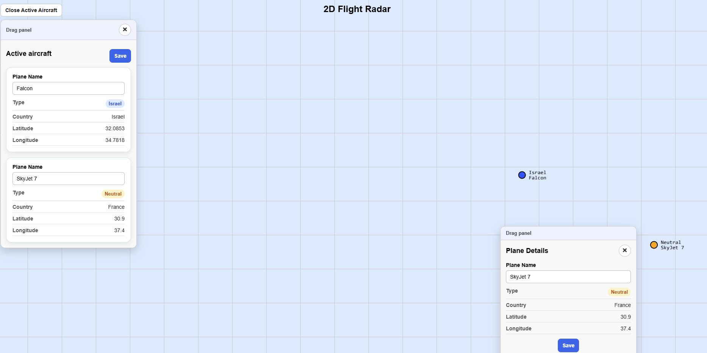
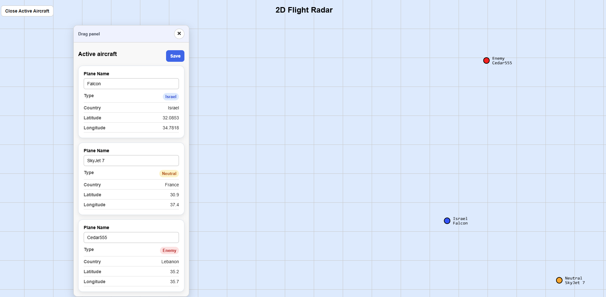

# 2D Flight Radar

A 2D flight radar application built with React, TypeScript, MobX, Deck.gl, and SharedWorker.

The project displays aircraft on a radar-style map, allows selecting and editing aircraft details, shows active aircraft in the current viewport, and manages plane updates through a shared worker communication layer.

## Tech Stack

- React
- TypeScript
- MobX
- mobx-react-lite
- Deck.gl
- SharedWorker
- CSS

## Project Structure

```text
src/
├── components/        # React UI components
├── constants/         # Reusable configuration values
├── data/              # Mock plane data
├── domain/            # Plane types and plane-related domain logic
├── map/               # Deck.gl rendering logic
├── services/          # Data services and worker client
├── stores/            # MobX stores and store instances
├── utils/             # General reusable utility functions
└── workers/           # SharedWorker logic and worker message types
```

## Instructions for Running the Project

### 1. Clone the repository

```bash
git clone https://github.com/NikolSap/Flight-radar-task.git
```

### 2. Navigate into the repository folder

```bash
cd Flight-radar-task
```

### 3. Navigate into the project folder

```bash
cd flight-radar
```

### 4. Open the project in VS Code

```bash
code .
```

Make sure VS Code is opened inside the `flight-radar` folder, where `package.json` and `src/` are located.
Open new terminal

### 5. Install dependencies

```bash
npm install
```

### 6. Run the development server

```bash
npm run dev
```

### 7. Open the app in the browser

After running the project, open the local URL shown in the terminal.

Usually it will be:

```text
http://localhost:5173
```

You can open the same local URL in multiple browser tabs to test SharedWorker synchronization.  
When a plane name is updated in one tab, the change is reflected in the other open tabs.

## Screenshots

### Selected Plane Panel



### Active Aircraft Panel


